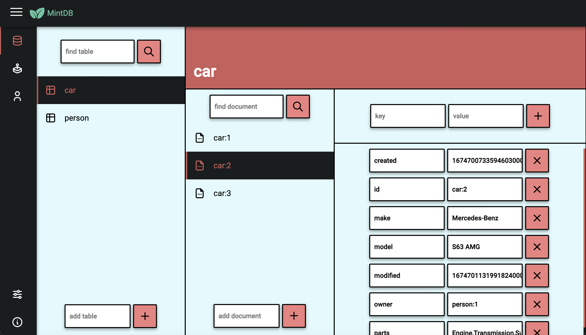
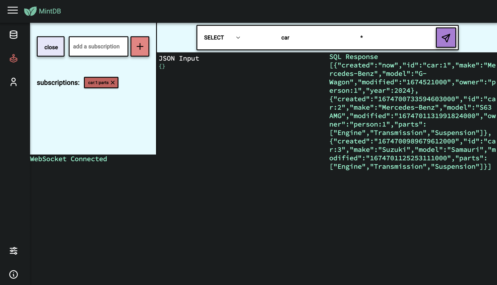

<p align="center">
    
    
</p>
<h2 align="center">An Open Source Graph Database</h2>
<p align="center">
    
    
    
    <a href="https://www.linkedin.com/in/eric-rodriguez-3a402811b/"></a>
</p>
*** For demonstrative purposes only

Introducing MintDB - a powerful, open-source embedded graph database built in Rust. With MintDB, you can easily manage and query your data using a simplified SQL-like JSON object and subscribe to real-time updates and events. The database supports relationships, offers both depth-first and breadth-first search capabilities, and comes with a built-in admin panel for visualizing and updating your data. The user interface is built with Vanilla Javascript, making it a lightweight and powerful solution. MintDB's simple API is perfect for modern web, mobile, and desktop applications, providing a secure and efficient way to manage your data.

<p align="center">
    
    
</p>

# Features 
- A user-friendly admin dashboard for managing your data
- A SQL and Websocket playground for testing queries and subscriptions
- Support for ACID transactions to ensure data integrity
- User authentication for secure access to your data
- A SQL API endpoint for querying your data
- A Websocket message publishing endpoint for real-time updates
- Real-time Websocket subscriptions for monitoring table, document, and key mutations
- [TypeScript SDK](https://www.npmjs.com/package/mintdb-js)

### Dependencies
```toml
[dependencies]
futures = "0.3.25"
mintdb = { path = "lib"}
once_cell = "1.16.0"
serde = { version = "1.0.148", features = ["derive", "rc"] }
serde_json = "1.0.89"
tokio = { version = "1.22.0", features = ["macros", "sync", "rt-multi-thread", "signal"]}
tokio-stream = "0.1.11"
uuid = { version = "1.2.2", features = ["serde", "v4"]}
warp = "0.3.3"
thiserror = "1.0.37"
```
# Get Started

Install the mintdb-server binary

```
cargo install mintdb-server@0.1.0-beta.3
```

Run the server

```
mintdb-server
```

Open http://127.0.0.1:8000 in your browser

# SQL API
Send a POST request to http://127.0.0.1:8000/sql with the following format
```json
{
    "stmt": "String",
    "tb": "String",
    "doc": "String",
    "data": {},
    "topic": "String",
    "user_id": 1,
    "message": "String",
}
```
### SELECT

Get One

Read a user
```
curl -X POST 'http://127.0.0.1:8000/sql' -H 'Content-Type: application/json' -d '{
    "stmt": "SELECT",
    "tb": "person",
    "doc": "person:1",
    "data": {},
    "topic": "",
    "user_id": 1,
    "message": ""    
}' 
```
Get All

Read all users
```
curl -X POST 'http://127.0.0.1:8000/sql' -H 'Content-Type: application/json' -d '{
    "stmt": "SELECT",
    "tb": "person",
    "doc": "*",
    "data": {},
    "topic": "",
    "user_id": 1,
    "message": ""    
}' 
```

### CREATE
Create a user

Returns an error if the person already exists
```
curl -X POST 'http://127.0.0.1:8000/sql' -H 'Content-Type: application/json' -d '{
    "stmt": "CREATE",
    "tb": "person",
    "doc": "person:4",
    "data": {
        "name": "Ricky",
        "email": "ricky@gmail.com",
        "city": "Miami",
    },
    "topic": "",
    "user_id": 1,
    "message": ""    
}' 
```
### MERGE
Merge data to a user document. 

This will create a new table or document if they do not exist.
```
curl -X POST 'http://127.0.0.1:8000/sql' -H 'Content-Type: application/json' -d '{
    "stmt": "MERGE",
    "tb": "person",
    "doc": "person:4",
    "data": {
        "phone": "305 578 5899"
    },
    "topic": "",
    "user_id": 1,
    "message": ""    
}' 
```
### DELETE
Delete a document
```
curl -X POST 'http://127.0.0.1:8000/sql' -H 'Content-Type: application/json' -d '{
    "stmt": "DELETE",
    "tb": "person",
    "doc": "person:4",
    "data": {},
    "topic": "",
    "user_id": 1,
    "message": ""    
}' 
```
### FIND
Find data by passing a Map of values to match. 

Returns a vector of documents that match any of the parameters.
```
curl -X POST 'http://127.0.0.1:8000/sql' -H 'Content-Type: application/json' -d '{
    "stmt": "FIND",
    "tb": "person",
    "doc": "",
    "data": { "phone": "305 578 5899" },
    "topic": "",
    "user_id": 1,
    "message": ""    
}' 
```
### MATCH
Find data by passing a Map of values to match. 

Returns a vector of documents that match all the parameters.
```
curl -X POST 'http://127.0.0.1:8000/sql' -H 'Content-Type: application/json' -d '{
    "stmt": "MATCH",
    "tb": "person",
    "doc": "",
    "data": { "state": "FL", "name": "Lucy" },
    "topic": "",
    "user_id": 1,
    "message": ""    
}' 
```

### COMPARE
Find data by passing a Map of:
```ts
{
    "lhs": "string", // The key of the document to compare.
    "op": "operator", // The operation to compare ("==", "!=" "<=" "<" ">=" ">" "contains" or "icontains")
    "rhs": "string or number" // The value to compare. Contains and icontains must use String
}
```

Returns a vector of documents that match the parameters.
```
curl -X POST 'http://127.0.0.1:8000/sql' -H 'Content-Type: application/json' -d '{
    "stmt": "MATCH",
    "tb": "car",
    "doc": "",
    "data": { "lhs": "make", "op": "==", "rhs": "Suzuki" },
    "topic": "",
    "user_id": 1,
    "message": ""    
}' 
```

Returns a vector of documents where the key is not the rhs.
```
curl -X POST 'http://127.0.0.1:8000/sql' -H 'Content-Type: application/json' -d '{
    "stmt": "MATCH",
    "tb": "car",
    "doc": "",
    "data": { "lhs": "make", "op": "!=", "rhs": "Suzuki" },
    "topic": "",
    "user_id": 1,
    "message": ""    
}' 
```

Returns a vector of documents where the key is greater than or equal to the rhs.
```
curl -X POST 'http://127.0.0.1:8000/sql' -H 'Content-Type: application/json' -d '{
    "stmt": "MATCH",
    "tb": "car",
    "doc": "",
    "data": { "lhs": "year", "op": ">=", "rhs": 2000 },
    "topic": "",
    "user_id": 1,
    "message": ""    
}' 
```

Returns a vector of documents where the key is greater than the rhs.
```
curl -X POST 'http://127.0.0.1:8000/sql' -H 'Content-Type: application/json' -d '{
    "stmt": "MATCH",
    "tb": "car",
    "doc": "",
    "data": { "lhs": "year", "op": ">", "rhs": 2000 },
    "topic": "",
    "user_id": 1,
    "message": ""    
}' 
```

Returns a vector of documents where the key is less than or equal to the rhs.
```
curl -X POST 'http://127.0.0.1:8000/sql' -H 'Content-Type: application/json' -d '{
    "stmt": "MATCH",
    "tb": "car",
    "doc": "",
    "data": { "lhs": "year", "op": "<=", "rhs": 2000 },
    "topic": "",
    "user_id": 1,
    "message": ""    
}' 
```

Returns a vector of documents where the key is less than the rhs.
```
curl -X POST 'http://127.0.0.1:8000/sql' -H 'Content-Type: application/json' -d '{
    "stmt": "MATCH",
    "tb": "car",
    "doc": "",
    "data": { "lhs": "year", "op": "<", "rhs": 2000 },
    "topic": "",
    "user_id": 1,
    "message": ""    
}' 
```

Returns a vector of documents where the key is a string and contains the value. Case sensitive.
```
curl -X POST 'http://127.0.0.1:8000/sql' -H 'Content-Type: application/json' -d '{
    "stmt": "MATCH",
    "tb": "car",
    "doc": "",
    "data": { "lhs": "model", "op": "contains", "rhs": "AMG" },
    "topic": "",
    "user_id": 1,
    "message": ""    
}' 
```

Returns a vector of documents where the key is a string and contains the value. Case insensitive.
```
curl -X POST 'http://127.0.0.1:8000/sql' -H 'Content-Type: application/json' -d '{
    "stmt": "MATCH",
    "tb": "car",
    "doc": "",
    "data": { "lhs": "model", "op": "icontains", "rhs": "amg" },
    "topic": "",
    "user_id": 1,
    "message": ""    
}' 
```
### INFO
Get the keys of all tables in the Database
```
curl -X POST 'http://127.0.0.1:8000/sql' -H 'Content-Type: application/json' -d '{
    "stmt": "INFO",
    "tb": "",
    "doc": "",
    "data": {},
    "topic": "",
    "user_id": 1,
    "message": ""    
}' 
```
### ADD
Add a table if it does not exist
```
curl -X POST 'http://127.0.0.1:8000/sql' -H 'Content-Type: application/json' -d '{
    "stmt": "ADD",
    "tb": "car",
    "doc": "",
    "data": {},
    "topic": "",
    "user_id": 1,
    "message": ""    
}' 
```
### PUSH
Pushes a value to an array specified by the key. 

If the key exists and is not an array, an error will be returned. If the key does not exist, a new array is created and the key value pair is inserted into the document.
```
curl -X POST 'http://127.0.0.1:8000/sql' -H 'Content-Type: application/json' -d '{
    "stmt": "PUSH",
    "tb": "car",
    "doc": "car:1",
    "data": { "key":"parts", "value":"engine" },
    "topic": "",
    "user_id": 1,
    "message": ""    
}' 
```
### PUT
Puts a value into a specified key. 

If the key exists, the value will be overwritten. If the key does not exist, the key value pair is inserted into the document.
```
curl -X POST 'http://127.0.0.1:8000/sql' -H 'Content-Type: application/json' -d '{
    "stmt": "PUT",
    "tb": "car",
    "doc": "car:1",
    "data": { "key":"owner", "value":"person:1" },
    "topic": "",
    "user_id": 1,
    "message": ""    
}' 
```
### REL
Relates two documents with a specified relationship. 

The relationship is added as an array in the key "rel:<rel>" and can be used for BFS and DFS
```
curl -X POST 'http://127.0.0.1:8000/sql' -H 'Content-Type: application/json' -d '{
    "stmt": "REL",
    "tb": "person",
    "doc": "person:1",
    "data": { "rel_tb":"person", "rel_doc":"person:2", "rel":"like" },
    "topic": "",
    "user_id": 1,
    "message": ""    
}' 
```
### BFS
Performs a BFS search for the target document with the specified relationship. 

The response returns either the first node containing the target, or an error message if not found.
```
curl -X POST 'http://127.0.0.1:8000/sql' -H 'Content-Type: application/json' -d '{
    "stmt": "BFS",
    "tb": "person",
    "doc": "person:1",
    "data": { "target":"person:2", "rel":"like" },
    "topic": "",
    "user_id": 1,
    "message": ""    
}' 
```
### DFS
Performs a DFS search for the target document with the specified relationship. 

The response returns either the first node containing the target, or an error message if not found.
```
curl -X POST 'http://127.0.0.1:8000/sql' -H 'Content-Type: application/json' -d '{
    "stmt": "DFS",
    "tb": "person",
    "doc": "person:1",
    "data": { "target":"person:2", "rel":"like" },
    "topic": "",
    "user_id": 1,
    "message": ""    
}' 
```

# User Authentication

Send a POST request to http://127.0.0.1:8000/auth with the following format
```json
{
    "event": "String",
    "username": "String",
    "password": "String",
}
```
### SignIn
Returns a JSON Web Token
```
curl -X POST 'http://127.0.0.1:8000/auth' -H 'Content-Type: application/json' -d '{
    "event": "signin",
    "username": "Lucy@gmail.com",
    "password": "abc123"
}' 
```
### SignUp
Returns a JSON Web Token
```
curl -X POST 'http://127.0.0.1:8000/auth' -H 'Content-Type: application/json' -d '{
    "event": "signup",
    "username": "Lucy@gmail.com",
    "password": "abc123"
}' 
```
### SignOut
```
curl -X POST 'http://127.0.0.1:8000/auth' -H 'Content-Type: application/json' -H 'Authorization: Bearer <JWT>' -d '{
    "event": "signout",
    "username": "",
    "password": ""
}' 
```
# Websocket Connection

Send a POST request to http://127.0.0.1:8000/register with the JSON payload { "user_id": i32 }
```
curl -X POST 'http://127.0.0.1:8000/register' -H 'Content-Type: application/json' -d '{ "user_id": 1 }' 
```

The response will be the websocket connection URL for the client
```JSON
{
  "url": "ws://127.0.0.1:8000/ws/4cc7c8ba4c144788a0e9bf9ee6840489"
}
```

Connect to the websocket url and add subscription topics from websocket client as JSON payload { "topics": Vec< String > }
```JSON
{ "topics": ["dogs", "sports"] }
```
Send a message to a topic channel via POST request to http://127.0.0.1:8000/publish with JSON payload { "user_id": i32, "message": String, topic: String }
```
{"user_id": "4cc7c8ba4c144788a0e9bf9ee6840489", "topic": "sports", "message": "Hello, world!"}
```
## Subscriptions
You may subscribe to mutations made within a table, document, or key. Given the table "person", document "person:1", and key "phone", the following subscriptions will receive the updated document on changes. Send the JSON object as a message to the websocket.

Subscribe to all mutations in table
```JSON
{ "topics": ["person"] }
```

Subscribe to all mutations in document person:1
```JSON
{ "topics": ["person:1"] }
```

Subscribe to all mutations of the key "phone" made to the person:1 document
```JSON
{ "topics": ["person:1:phone"] }
```
### Unregister a client
Send a DELETE request to http://127.0.0.1:8000/register/{user_id}
```
curl -X DELETE 'http://127.0.0.1:8000/register/{user_id}' 
```

### Endpoints
- Admin Console: GET / manage the database from a web UI
- SQL API: POST /sql
- Auth API: POST /auth
- Publish API: POST /publish Post to publish messages to subscribers
- Health API: POST /health Post to check server status
- Register: POST /register Responds with a websocket endpoint to connect to
- WebSocket Server ws://127.0.0.1:8000/ws/{id}